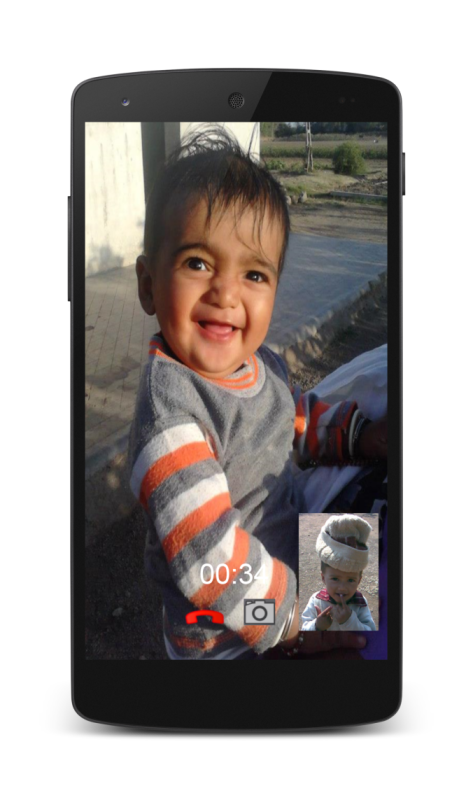

*Video Calling library for Android - Sample Application*



#### Download
 * [AAR](https://github.com/3bytessolutions/CallService-sample#get-library)

#### Features
 * Easy to use library for Android
 * No need to own or configure TURN/STUN server
 * Single API call to Initiate, Receive or Decline a call
 * Works for Video and Audio calls
 * Configurable Video/Audio quality
 * No charges

#### Sample Application

[Install from Play Store](https://play.google.com/store/apps/details?id=com.threebytes.callservicesample)
This is a very basic sample application, for making and receiving a video call. Below are different classes of the app and it's usage:

 * [Main Activity](https://github.com/3bytessolutions/CallService-sample/blob/master/app/src/main/java/com/threebytes/callservicesample/MainActivity.java)
   * User Interface for Registration and Initiating a call
   * Registration is an one-time activity
   * User IDs should be unique per application
 * Outgoing and Incoming Call Activity
   * UI for call negotiation
 * Call Events
   * IntentService and Broadcast receiver for call events

#### Examples

Here are basic functions for making a video call:

#### Initiate a Call

```java
CallService.getDefaultInstance().initiateCall(remoteId, this, new CallService.Callback() {
    @Override
    public void onError(Exception error) {
	    // handle errors here
	}
	@Override
    public void onSuccess() {
	    // there you go, request is sent
	}
});
```

#### Respond to a call request

```java
CallService.getDefaultInstance().callResponse(remoteId, true, this, new CallService.Callback() {
    @Override
    public void onError(Exception error) {
	    // handle errors here
	}
	@Override
    public void onSuccess() {
	    // all set, will start streaming
	}
});
```

#### Register first

```java
CallService.getDefaultInstance().register(userId, GOOGLE_CLOUD_PROJECT_ID, MainActivity.this, new CallService.Callback() {
    @Override
    public void onError(Exception error) {
	     // something went wrong
	}
	@Override
    public void onSuccess() {
	    // done, you can make/receive call now
	}
});
```

#### Get Library

##### AAR
 * [CallService.aar](https://github.com/3bytessolutions/CallService-sample/blob/master/CallService/CallService.aar)

#### Get the library access

You'll need to send an email to [mail@3bytes.co.in](mailto:mail@3bytes.co.in) with following details:

* Your Application Package Name
* SHA1 fingerprints of debug and release keys
* Google Cloud Project ID (It can be a blank project)
* API key for server application, for public access (from the same Google Cloud Project)
* Your contact email address
